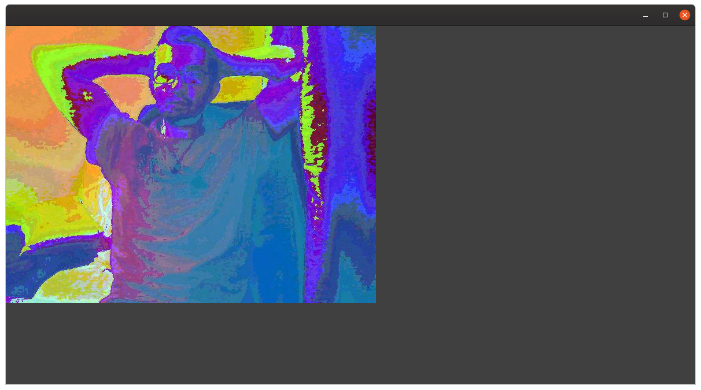
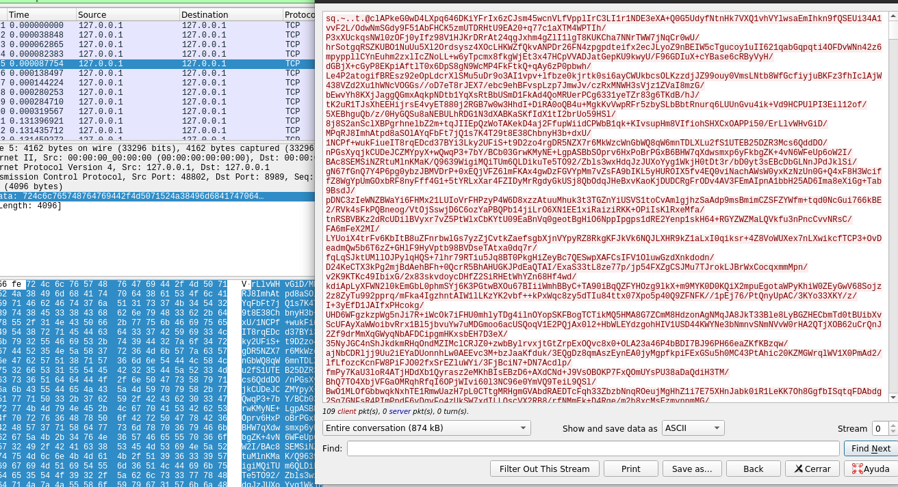

Encrypt /decrypt video data:

server-side source:

Initial version on realtime, for each frame:
-get Matrix RGB pixe position and  encrypt /decrypt
-set x,y position

Encryption ALgorithm xor. Server side image before decryption xor:

On the next Step we work in order to simplify the algorithm complexity, using an unique encryption for frame(image).
On serializable class Frame we include encrypted image with the next format:

- String (Base64[ encrypted Symetric AES (image bytes)]) 
  
In this case the server an client usign Symetric encryption, and must shared the same privatekey during the socket operation, for this test;

 
 
 Server :
 
  netstat -putona | grep 8989
(No todos los procesos pueden ser identificados, no hay información de propiedad del proceso
 no se mostrarán, necesita ser superusuario para verlos todos.)
tcp6       0      0 :::8989                 :::*                    ESCUCHAR    2455/java            apagado (0.00/0/0)
 
 
 Server + Client :
 
 netstat -putona | grep 8989 | grep -v CLOSE
(No todos los procesos pueden ser identificados, no hay información de propiedad del proceso
 no se mostrarán, necesita ser superusuario para verlos todos.)
tcp6       2      0 :::8989                 :::*                    ESCUCHAR    2455/java            apagado (0.00/0/0)
tcp6       4      0 127.0.0.1:8989          127.0.0.1:48886         ESTABLECIDO -                    apagado (0.00/0/0)
tcp6       0      0 127.0.0.1:48886         127.0.0.1:8989          ESTABLECIDO 2683/java            apagado (0.00/0/0)
 
 
 
 Server-side Image of webcam after decryption:
 
 